# AI Mood Weather Station - Lovable Vibe Coding Masterclass

This tutorial is a comprehensive guide to building a full-stack web application called **"AI Mood Weather Station"** using **Lovable.dev**. We will demonstrate how to build a dynamic UI, integrate a cloud database (Lovable Cloud / Supabase), and securely query a Large Language Model (LLM) API (OpenRouter) using free models—all while working strictly within Lovable's free tier credit limits.

This masterclass is structured to serve three distinct audiences:
1. **Primary School Students**: Concepts explained through engaging real-world analogies.
2. **General University Students**: A system-design approach focusing on data flow and user experience (UX).
3. **Computer Science (CS) Majors**: A deep dive into full-stack architecture, database schemas, secure serverless functions, and React integration.

---

## 💡 Lovable Credit-Saving Golden Rules

Lovable's free tier provides a limited number of credits. To complete a full project without running out of credits, students must learn to work efficiently:

```
+-------------------------------------------------------------------+
|                     LOVABLE CREDIT-SAVING RULES                   |
+------------------------------------+------------------------------+
| 1. Plan before Prompting           | Design your layout first.    |
|                                    | Give comprehensive prompts   |
|                                    | instead of tiny changes.     |
+------------------------------------+------------------------------+
| 2. Use Visual Edits (Free!)        | Modifying colors, fonts, and |
|                                    | sizes directly on the screen |
|                                    | does NOT consume any credit! |
+------------------------------------+------------------------------+
| 3. Use Version Rollback            | If the AI breaks something,  |
|                                    | roll back in the history     |
|                                    | panel instead of prompting   |
|                                    | the AI to "fix it."          |
+------------------------------------+------------------------------+
```

---

## 🎯 Project Blueprint: AI Mood Weather Station ☀️🌧️❄️

The application allows users to log their mood and witness their screen transform dynamically:
* **Input**: A text area where users write down their feelings.
* **Processing**: An LLM API analyzes the text, assigns a sentiment score, and generates a tailored encouraging response.
* **Storage**: Mood logs are written to a PostgreSQL database.
* **Output**: The background renders interactive weather animations (Sunny for positive thoughts, Cloudy for neutral thoughts, Rainy for sadness, and Snowy for isolation). A line chart displays the 7-day mood trend.

---

## 📖 Step-by-Step Construction Walkthrough

---

### Step 1: Project Initialization & Initial Prompt

To start, create a new project in your Lovable dashboard. Ensure the chat input is set to **Build** mode.

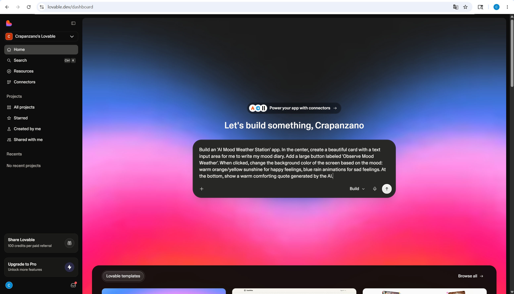
*Figure 1: Choosing 'Build' mode and typing the initial prompt.*

Copy and paste the following prompt to build the core interface:

```text
Build an 'AI Mood Weather Station' app. In the center, create a beautiful card with a text input area for me to write my mood diary. Add a large button labeled 'Observe Mood Weather'. When clicked, change the background color of the screen based on the mood: warm orange/yellow sunshine for happy feelings, blue rain animations for sad feelings. At the bottom, show a warm comforting quote generated by the AI.
```

Once submitted, Lovable will compile the frontend interface and setup local mockup states:

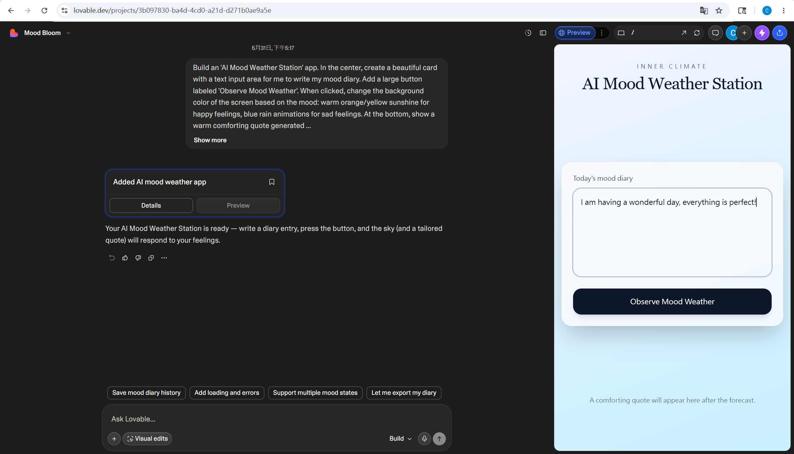
*Figure 2: The completed initial UI featuring the mood text area and button.*

---

### Step 2: Testing the Initial Simulation

Before integrating cloud services, test the frontend simulation locally in the right-hand **Preview** panel.

#### Testing a Happy Mood:
Type: `I am having a wonderful day, everything is perfect!` and click **Observe Mood Weather**.


*Figure 3: Sunny weather effect triggered by positive input.*

#### Testing a Sad Mood:
Type: `I lost my wallet today, feeling very sad...` and click the button.

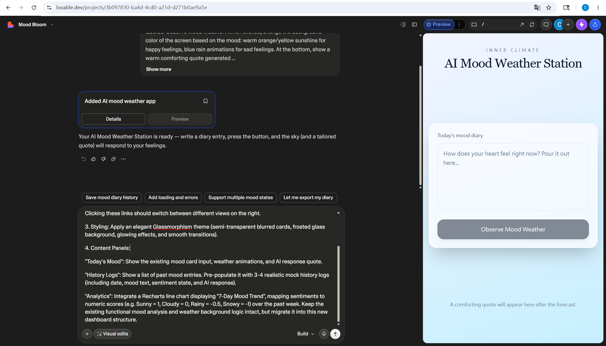
*Figure 4: Rainy weather effect triggered by negative input.*

---

### Step 3: Upgrading to a Professional Dashboard (Level 2)

Next, we will upgrade the single-card layout into a multi-tab dashboard with Glassmorphism styling and data visualization. Enter this prompt:

```text
Upgrade this application into a professional Glassmorphism Mood Dashboard. 
1. Layout: Implement a responsive two-column layout. On the left, there should be a sleek sidebar navigation. On the right, a main content area.
2. Sidebar Navigation: Include links/buttons for "Today's Mood", "History Logs", and "Analytics". Clicking these links should switch between different views on the right.
3. Styling: Apply an elegant Glassmorphism theme (semi-transparent blurred cards, frosted glass background, glowing effects, and smooth transitions).
4. Content Panels:
   - "Today's Mood": Show the existing mood card input, weather animations, and AI response quote.
   - "History Logs": Show a list of past mood entries. Pre-populate it with 3-4 realistic mock history logs (including date, mood text, sentiment state, and AI response).
   - "Analytics": Integrate a Recharts line chart displaying "7-Day Mood Trend", mapping sentiments to numeric scores (e.g. Sunny = 1, Cloudy = 0, Rainy = -0.5, Snowy = -1) over the past week.
Keep the existing functional mood analysis and weather background logic intact, but migrate it into this new dashboard structure.
```

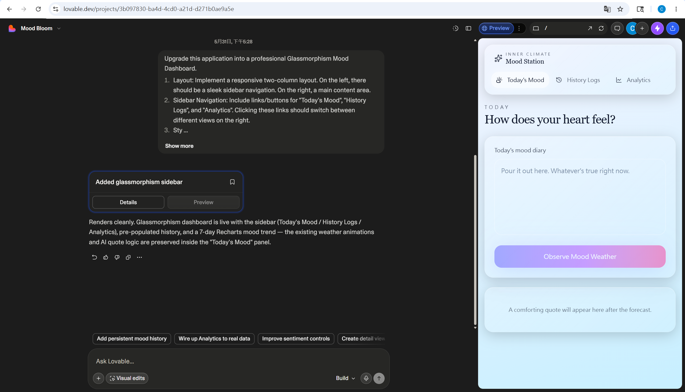
*Figure 5: The newly generated dashboard layout featuring Glassmorphism tabs.*

Click through the navigation tabs to inspect the upgraded layout:

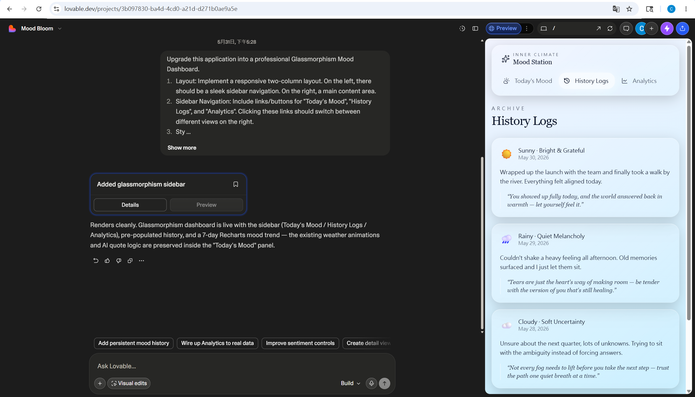
*Figure 6: The History Logs tab displaying mock entries.*

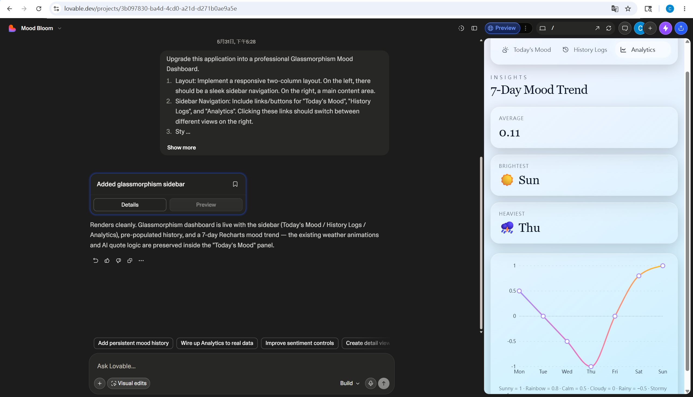
*Figure 7: The Analytics tab displaying the pre-populated 7-Day Trend Chart.*

---

### Step 4: OpenRouter API Registration (Level 3)

To retrieve real AI sentiment scores and messages, we will use **OpenRouter**, an aggregator that provides access to free high-performance LLM APIs.

1. Go to [OpenRouter.ai](https://openrouter.ai/).
2. Log in using your Google or GitHub account.
3. Go to **API Keys** and click **Create Key**.

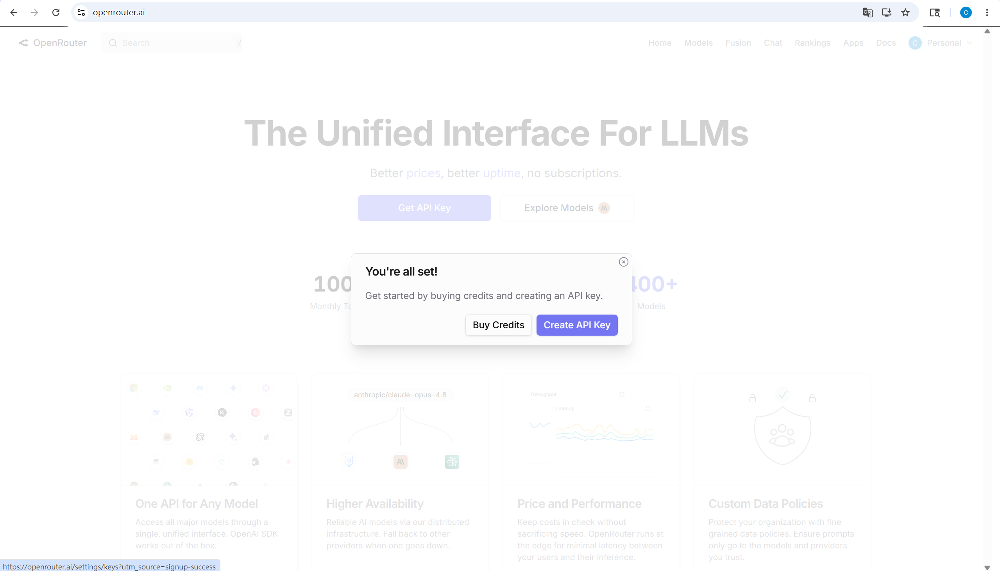
*Figure 8: Creating the OpenRouter API Key (sk-or-...).*

*Copy and save your generated API key in a secure text file.*

---

### Step 5: Connecting the Database & API Key

Now, submit the integration prompt to hook up the database and OpenRouter API:

```text
Connect this app to Supabase and OpenRouter API for real mood weather tracking.
1. DB Setup: Create a Supabase database table named "mood_entries" with the following columns: id (UUID), user_id (UUID), mood_text (TEXT), sentiment (TEXT, either Sunny, Cloudy, Rainy, Snowy), sentiment_score (REAL), ai_response (TEXT), and created_at (TIMESTAMP).
2. API Proxy: Create a Supabase Edge Function to handle mood analysis securely, preventing the OpenRouter API key from being exposed to the browser.
3. API Request: In the Edge Function, call OpenRouter API at "https://openrouter.ai/api/v1/chat/completions" using the model "nvidia/nemotron-3-nano-30b-a3b:free". It should read the user's mood text and return a JSON payload with sentiment, sentiment_score, and a warm encouraging ai_response.
4. Flow integration: Save the analyzed results to the "mood_entries" table, and return the record to the React frontend to update the weather background and history log in real-time.
```

Lovable will detect the external API requirement and prompt you to input your secret.

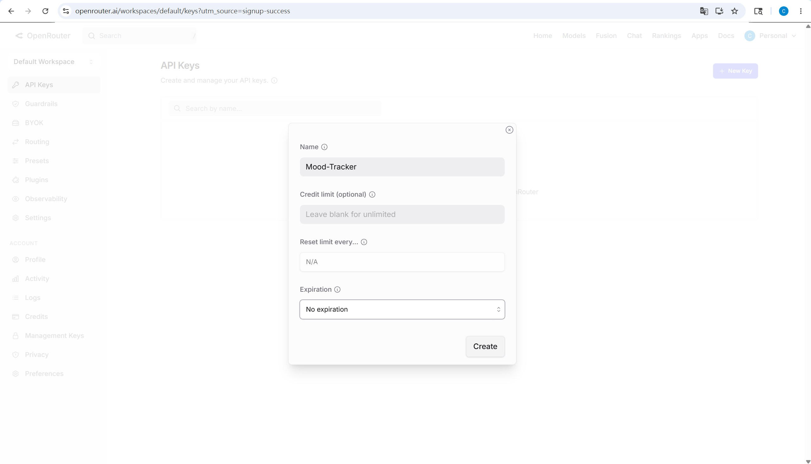
*Figure 9: Lovable Cloud prompts the user to submit their OpenRouter API key securely.*

Lovable automatically configures its built-in database (Lovable Cloud) and deploys a secure server-side TanStack proxy function:

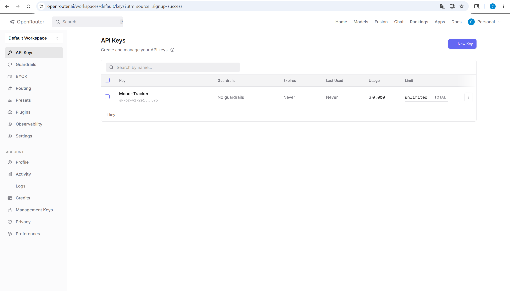
*Figure 10: Successful completion showing RLS configurations, server proxy, and frontend hooks.*

---

### Step 6: Platform Constraints & Git Integration

If you open the in-app code editor on Lovable's free plan, you will notice it is **Read Only**. 

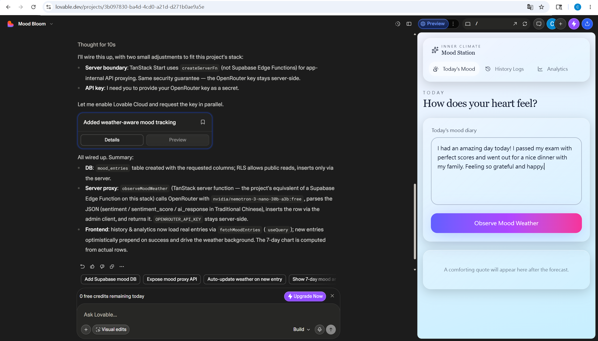
*Figure 11: In-app manual code edits are locked behind the Pro upgrade.*

To modify code manually without consuming credits, configure **GitHub Sync**:

1. Click on the project name menu or go to Settings.
2. Select the **Git** configuration tab.
3. Authenticate with GitHub and connect a repository.

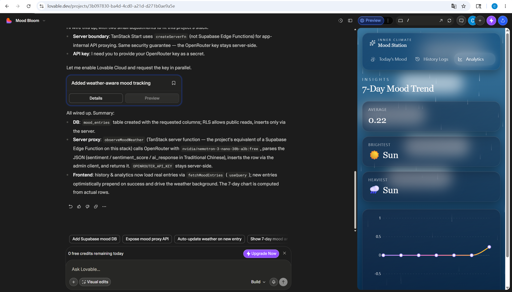
*Figure 12: Syncing the Lovable project with a GitHub repository.*

*This sets up a two-way sync: modifications committed to GitHub will automatically sync back to Lovable.*

---

### Step 7: Local English Output Refinement

We will now prompt Lovable to ensure the generated comforting quotes are in English. 

```text
Please change the AI response (comforting quote) language in the server function from Traditional Chinese to English.
```

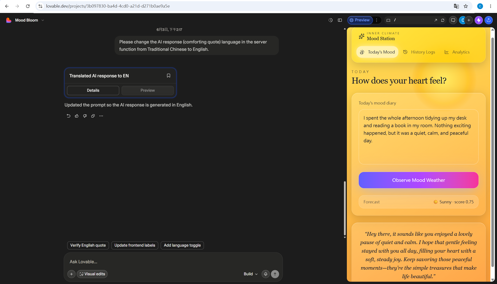
*Figure 13: Prompt update confirming the server function now instructs the LLM to output in English.*

We can now test the fully integrated system with English outputs:

#### Testing a Positive Mood (Sunny ☀️):
Input: `I spent the whole afternoon tidying up my desk and reading a book in my room. Nothing exciting happened, but it was a quiet, calm, and peaceful day.`


*Figure 14: Sunny output with a corresponding English quote.*

#### Testing an Isolated Mood (Snowy ❄️):
Input: `I feel so empty and detached today. It feels like I'm completely frozen and I don't have the energy to talk to anyone or do anything. Just feeling cold and isolated.`

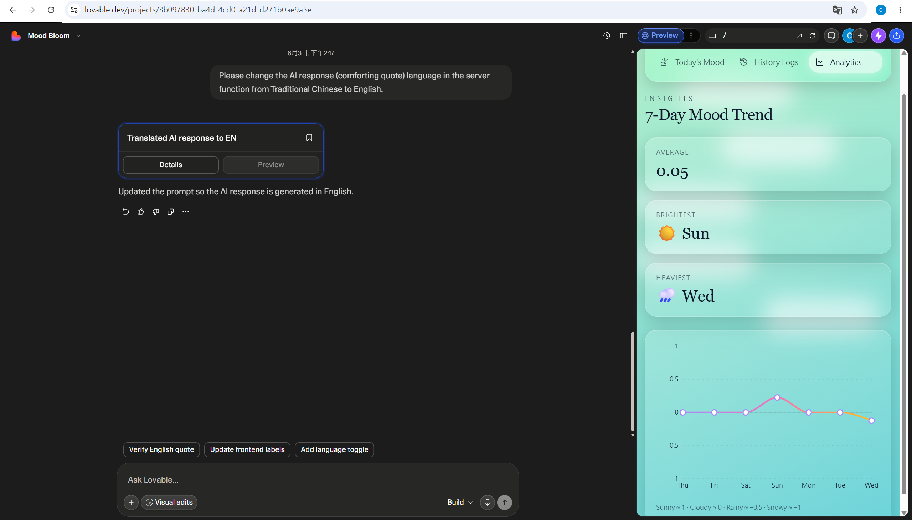
*Figure 15: Snowy background and quote successfully returned in English.*

---

### Step 8: Verifying Database Persistence & Analytics

Click **History Logs** to check if the records are saved in Lovable Cloud's database:

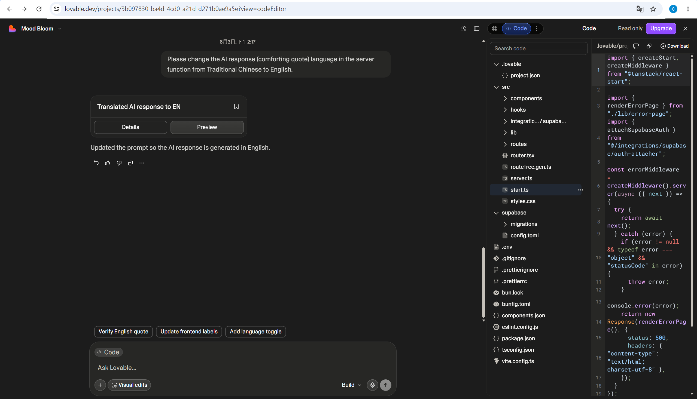
*Figure 16: History Logs displaying actual entries pulled from the database.*

Click **Analytics** to verify that the chart draws line plots based on actual database entries:

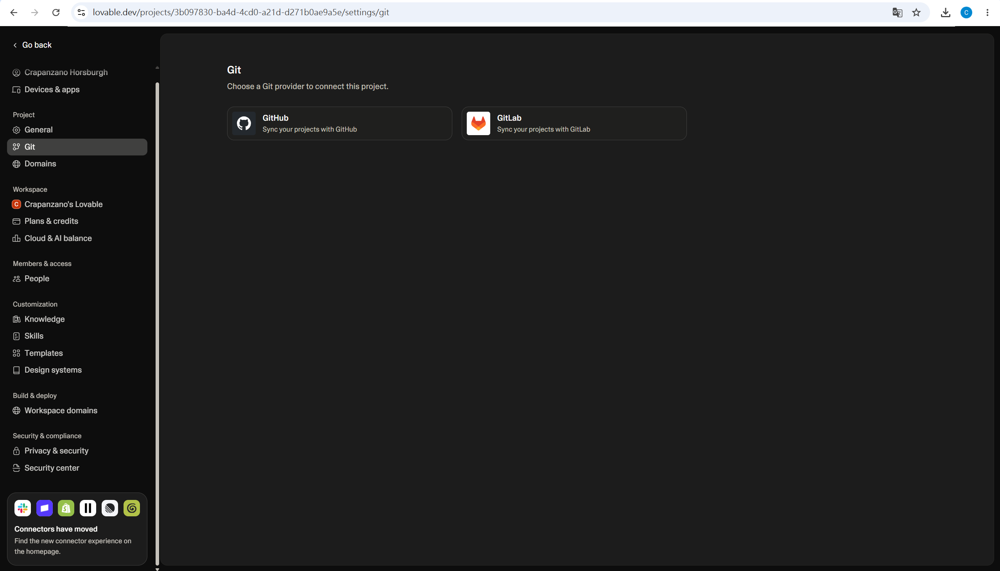
*Figure 17: Recharts line plotting real sentiment scores extracted from database logs.*

Finally, view your repository on GitHub. All code edits, commits, and assets have been automatically pushed:

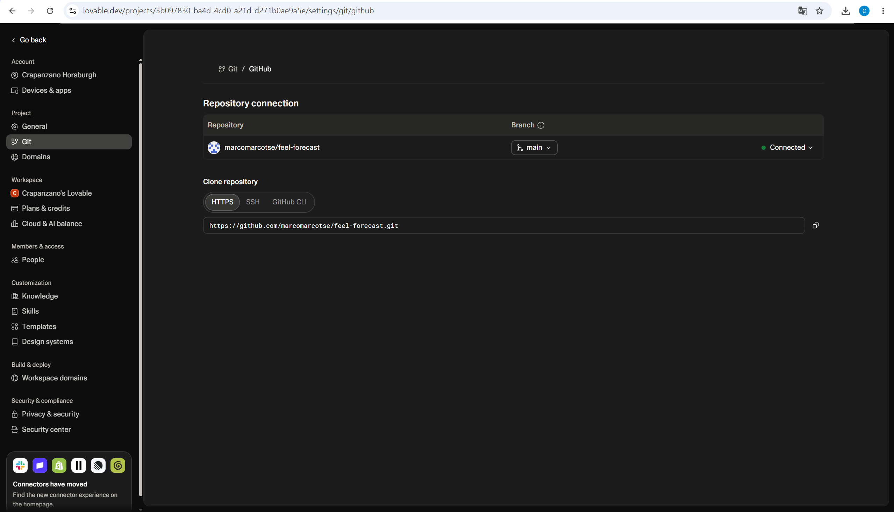
*Figure 18: The populated GitHub repository containing the complete codebase.*

---

## 🎓 Pedagogical Breakdown (Lesson Guide)

---

### Level 1: Primary School Level

*   **Vibe Coding (The Magic Drawing Board)**: Explain that typing prompts is like having a magic crayon. You write down a description, and the board draws the buttons and backgrounds automatically.
*   **Database (The Memory Diary)**: Contrast a whiteboard with a diary. If you write your mood on a whiteboard (unpersisted state), it disappears when someone wipes it (page refresh). A database is a magical diary that locks the pages in a safe, keeping them forever.
*   **LLM API (The Wise Owl)**: Explain that the app cannot think. When we send a diary entry, a messenger bird carries it to the **Wise Owl (LLM)** in the cloud forest. The owl reads it, figures out if it's happy or sad, and sends a letter back telling the screen what color to paint.

---

### Level 2: General University Students

*   **Client-Server Model**: Explain the separation of duties. The browser (Client) displays the animations and buttons, while the backend (Server) holds the API keys securely and logs records into the Database.
*   **Structured Data Mapping**: Show how unstructured raw text is mapped to quantitative values for analytics:
    *   `Sunny` $\rightarrow$ 1.0 (highly positive)
    *   `Cloudy` $\rightarrow$ 0.0 (neutral)
    *   `Rainy` $\rightarrow$ -0.5 (frustrated/sad)
    *   `Snowy` $\rightarrow$ -1.0 (numb/isolated)
    *   These values are plotted over time using chart libraries to make emotional fluctuations legible.

---

### Level 3: CS Majors

#### 1. Full-Stack Architecture Diagram
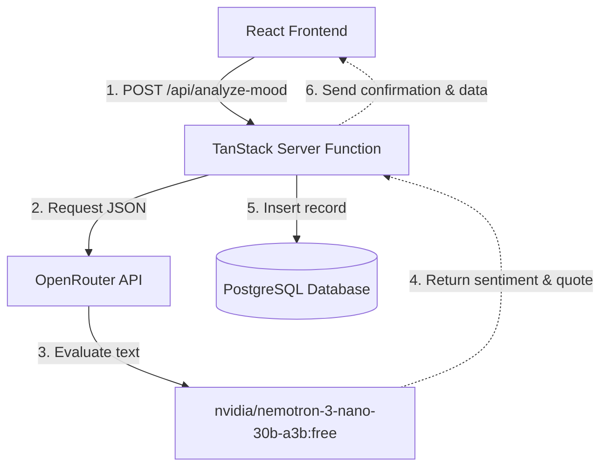

#### 2. Database Schema (PostgreSQL DDL)
```sql
CREATE TABLE IF NOT EXISTS public.mood_entries (
    id UUID PRIMARY KEY DEFAULT gen_random_uuid(),
    user_id UUID REFERENCES auth.users(id) ON DELETE CASCADE,
    mood_text TEXT NOT NULL,
    sentiment TEXT NOT NULL CHECK (sentiment IN ('Sunny', 'Cloudy', 'Rainy', 'Snowy')),
    sentiment_score REAL NOT NULL,
    ai_response TEXT NOT NULL,
    created_at TIMESTAMP WITH TIME ZONE DEFAULT timezone('utc'::text, now()) NOT NULL
);

-- Optimize for user-specific historical sorting
CREATE INDEX IF NOT EXISTS mood_entries_user_id_idx ON public.mood_entries(user_id);
CREATE INDEX IF NOT EXISTS mood_entries_created_at_idx ON public.mood_entries(created_at DESC);

-- Enable RLS
ALTER TABLE public.mood_entries ENABLE ROW LEVEL SECURITY;

-- Security Policies
CREATE POLICY "Users can insert their own mood entries" 
ON public.mood_entries FOR INSERT 
WITH CHECK (auth.uid() = user_id);

CREATE POLICY "Users can view their own mood entries" 
ON public.mood_entries FOR SELECT 
USING (auth.uid() = user_id);
```

#### 3. Secure Server-Side Proxy Function (TanStack Start API Route)
```typescript
import { createServerFn } from "@tanstack/react-start";
import { createClient } from "@supabase/supabase-js";

export const observeMoodWeather = createServerFn(
  "POST",
  async (moodText: string, rethrow) => {
    try {
      const openRouterApiKey = process.env.OPENROUTER_API_KEY;
      if (!openRouterApiKey) throw new Error("Missing API Key");

      const response = await fetch("https://openrouter.ai/api/v1/chat/completions", {
        method: "POST",
        headers: {
          "Authorization": `Bearer ${openRouterApiKey}`,
          "Content-Type": "application/json"
        },
        body: JSON.stringify({
          model: "nvidia/nemotron-3-nano-30b-a3b:free",
          messages: [
            {
              role: "system",
              content: `Analyze the user's mood text and return a strict JSON payload containing:
              - "sentiment": 'Sunny', 'Cloudy', 'Rainy', or 'Snowy'
              - "sentiment_score": float between -1.0 and 1.0
              - "ai_response": a comforting encouraging quote in English.
              No markdown formatting.`
            },
            { role: "user", content: moodText }
          ]
        })
      });

      const data = await response.json();
      const result = JSON.parse(data.choices[0].message.content.trim());

      // Save to Database
      const supabase = createClient(process.env.SUPABASE_URL!, process.env.SUPABASE_SERVICE_ROLE_KEY!);
      const { data: record, error } = await supabase
        .from("mood_entries")
        .insert({
          mood_text: moodText,
          sentiment: result.sentiment,
          sentiment_score: result.sentiment_score,
          ai_response: result.ai_response
        })
        .select()
        .single();

      if (error) throw error;
      return record;
    } catch (err) {
      console.error("Server API Error:", err);
      throw err;
    }
  }
);
```
